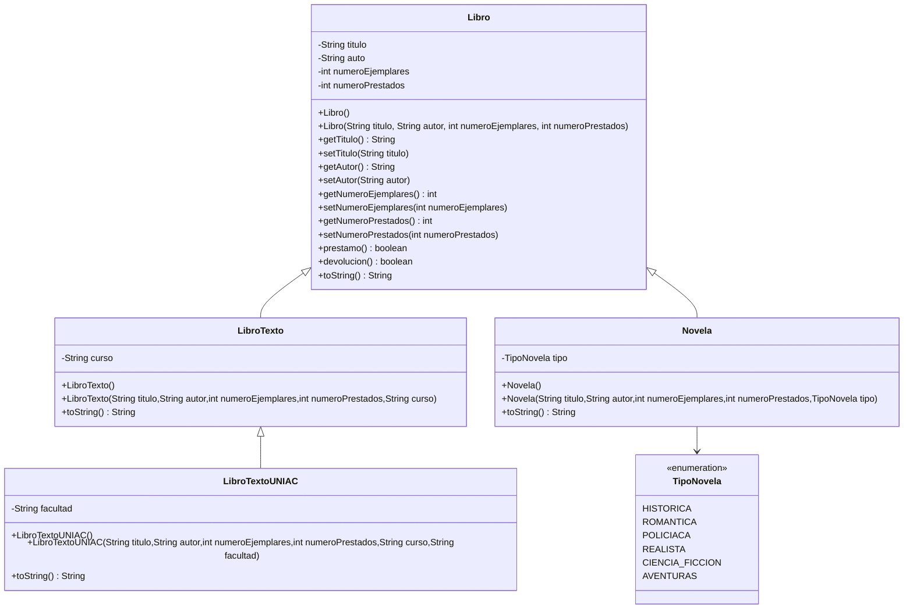

# Parcial I - Programacion II (G412)

# Sistema de Biblioteca en Java

## Descripción

Este proyecto implementa un sistema simple de gestión de biblioteca utilizando Programación Orientada a Objetos (POO) en Java.

El sistema permite manejar diferentes tipos de libros y aplicar conceptos como herencia, encapsulamiento y abstracción.

## Conceptos utilizados

* Programación Orientada a Objetos
* Herencia
* Encapsulamiento
* Constructores
* Métodos

-------------------------------
# DIAGRAMA UML DE CLASES 

# Cómo ejecutar el programa

1. Abrir el proyecto en **Visual Studio Code**.
2. Ir a la carpeta `src/main/java`.
3. Abrir el archivo **Main.java**.
4. Ejecutar el programa presionando **Run** o haciendo clic derecho y seleccionando **Run Java**.

El resultado se mostrará en la **terminal de Visual Studio Code**.

# Lo que piden en el Parcial

Desarrollar un sistema de gestión de libros en **Java** aplicando conceptos de **Programación Orientada a Objetos**.

Crear la clase **Libro** con sus atributos, constructores, métodos `get` y `set`, y los métodos `prestamo()` y `devolucion()`.

Aplicar **herencia** creando las clases **LibroTexto**, **LibroTextoUNIAC** y **Novela**, cada una con sus atributos y constructores correspondientes.

Construir el **diagrama UML de clases** del sistema.

En la clase **Main**, se deben crear cuatro objetos (libro1, libro2, libroTextoUNIAC y novela) y probar los métodos de **préstamo y devolución**.

--------------------------------------------
 # Situaciones donde no se puede heredar
// ------------------------------

// 1. No se puede heredar de una clase que esté marcada como "sealed"
// si la clase hija no está permitida en la lista de permisos.
// Ejemplo:
// public sealed class Libro permits LibroTexto { }

// 2. No se puede heredar de una clase que esté en otro paquete
// si la clase no tiene el modificador public.

--------------------------------------------
 # Fragmento de código e identificar las posibles fallas
// ------------------------------

Fragmento analizado: método de préstamo de libros.

Una posible falla del sistema podría ocurrir cuando el usuario ingresa datos incorrectos desde la consola. Por ejemplo, si el programa solicita el número de ejemplares disponibles y el usuario escribe texto en lugar de un número, el programa podría generar un error y detener su ejecución.

Otro escenario donde el código podría no funcionar correctamente es si el número de ejemplares prestados es mayor que el número total de ejemplares del libro. En ese caso, la lógica del sistema podría permitir operaciones incorrectas o mostrar información inconsistente sobre la disponibilidad del libro.

Aunque el código funciona en condiciones normales, estos escenarios muestran situaciones en las que el programa podría fallar si no se validan adecuadamente los datos de entrada.

--------------------------------------------
 # Los nuevos atributos que se puedan agregar al ejercicio y un método adicional que tengan sentido y se puedan implementar
// ------------------------------

Dos nuevos atributos que se podrían agregar al sistema son:

1. **ubicacionEstanteria**: permitiría indicar en qué estantería o sección de la biblioteca se encuentra físicamente el libro, lo que facilitaría su localización dentro de la biblioteca.
2. **nivelDificultadLectura**: permitiría clasificar el libro según su nivel de complejidad (básico, intermedio o avanzado), lo cual ayudaría a los lectores a elegir libros adecuados para su nivel.

Un método adicional que se podría implementar es **recomendarLibro()**, el cual podría sugerir un libro al usuario según su nivel de lectura o preferencia de género, mejorando así la experiencia del sistema de biblioteca.
